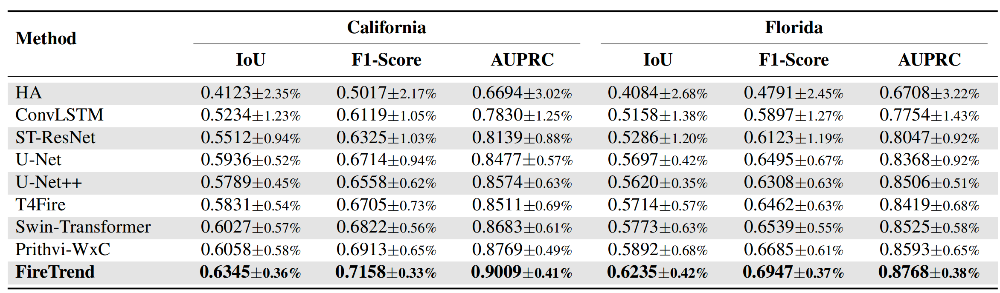
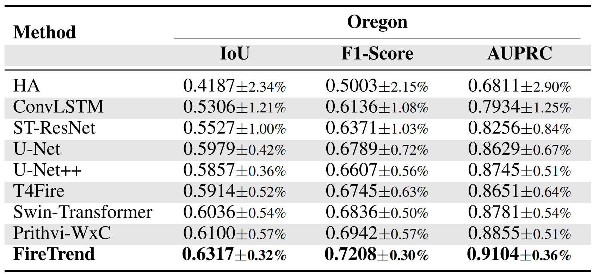
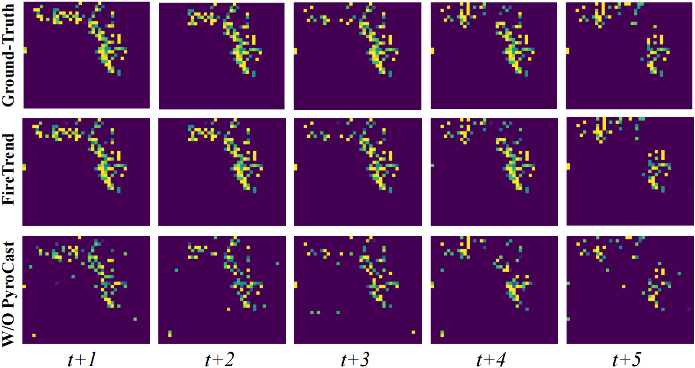
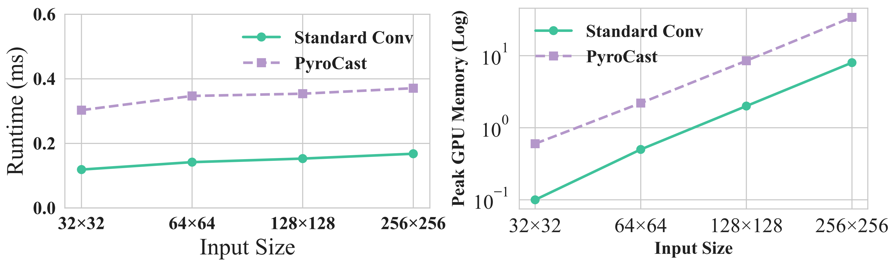

# 🔥FireTrend

### FireTrend: Learning Physics-Guided Latent Fire Dynamics for Wildfire Risk-Level Forecasting

<p align="center">
     
</p>

> FireTrend is an end to end multimodal framework for regional spatiotemporal wildfire risk forecasting. It integrates meteorological records, satellite based fire observations, and geospatial information through a multimodal spatial-temporal Transformer encoder. To improve representation quality, FireTrend introduces a multi-view contrastive learning schema that enforces temporal consistency, spatial coherence, and cross-modal alignment in the latent space. In the updated implementation, the physics-guided module named **PyroCast** models environmental-driven latent fire-state propagation using directional dynamic convolutions, and a downstream classifier predicts ordinal wildfire risk levels.

## FireCast Dataset

FireCast-US dataset integrates multi-source environmental, vegetation, topography, fuel, meteorological, and wildfire risk data into a unified spatial-temporal HDF5 format for wildfire modeling and analysis. We have prepared two well-formatted `FireCast-CA` and `FireCast-FL` subsets of FireCast-US in this package, as introduced below:

### Repository Dataset Structure

```
data_v2/
│
├── CA_wildfire_grid_ERA5_LANDFIRE_aligned.h5
│
├── FL_wildfire_grid_ERA5_LANDFIRE_aligned.h5
│
├── OR_wildfire_grid_ERA5_LANDFIRE_aligned.h5

```

Each `.h5` file contains daily grid-based wildfire risk score and aligned multi-modal features at a spatial resolution of 0.25° × 0.25°.


### Full Dataset Availability

⚠️ NOTE that the **complete FireCast-CA** and **FireCast-FL** are too large to be uploaded directly in the GitHub repository. 
Therefore, The full dataset is provided via an **anonymized Google Drive link**:
  
> https://drive.google.com/drive/folders/13_1l7uCxD6APLFWe4ZLUAhM1f_Lnz1ie?usp=sharing


### How to Load the Dataset

Example using `h5py`:

```python
import h5py

with h5py.File("CA_wildfire_grid_ERA5_LANDFIRE_aligned.h5", "r") as f:
  print(list(f.keys()))
  wildfire = f["wildfire_risk"][:]
```


FireCast dataset is constructed through a unified pipeline consisting of the following stages:


<p align="center">
     
</p>


### FireCast Data Acquisition & Dataset Features

<!--
### Data Shape

Unless otherwise specified, the `shape of each feature` is **(time, latitude_index_feature_value, longitude_index_feature_value)**. 
For the full dataset, the time spans from `Febr 2023` to `Dec 2025` with **daily resolution**.
-->

The dataset integrates information from:

- **LANDFIRE** (Vegetation, Topography, Fuel)
- **ERA5 Reanalysis** (Meteorological variables)
- **Wildfire Risk Observations** (NASA Satellite Observations)


## Features and Sources

Below is the complete list of subsets stored inside each `.h5` file:

---

### 🌿 Vegetation Features – LANDFIRE 

| Subset Name | Full Name | Description |
|-------------|-----------|-------------|
| `EVH` | Existing Vegetation Height | Height of existing vegetation |
| `EVC` | Existing Vegetation Cover | Percentage vegetation cover |
| `EVT` | Existing Vegetation Type | Categorical vegetation type classification |

**Source:** LANDFIRE Vegetation Layers

---

### 🏔 Topography Features – LANDFIRE

| Subset Name | Full Name | Description |
|-------------|-----------|-------------|
| `Aspect` | Terrain Aspect | Direction slope faces |
| `Slope` | Terrain Slope | Gradient of terrain |
| `Elevation` | Terrain Elevation | Elevation above sea level |

**Source:** LANDFIRE Topographic Layers


### 🔥 Fuel Features – LANDFIRE

| Subset Name | Full Name | Description |
|-------------|-----------|-------------|
| `CBD` | Forest Canopy Bulk Density | Canopy fuel density |
| `FVH` | Fuel Vegetation Height | Height of fuel vegetation |
| `FVC` | Fuel Vegetation Cover | Coverage of fuel vegetation |
| `FVT` | Fuel Vegetation Type | Fuel vegetation classification |

**Source:** LANDFIRE Fuel Layers


### 🌦 Meteorological FeaturesERA5 – ERA5

All meteorological features are derived from the **ERA5 reanalysis dataset** (ECMWF).
ERA5 originally provides 6-hour resolution data.
In FireCast, the data is aggregated to **daily resolution**.

| Subset Name | Full Name | Description |
|-------------|-----------|-------------|
| `d2m` | 2m Dewpoint Temperature | Near-surface dew point temperature |
| `msl` | Mean Sea Level Pressure | Surface pressure at sea level |
| `sp` | Surface Pressure | Surface atmospheric pressure |
| `stl1` | Soil Temperature Level 1 | Top-layer soil temperature |
| `swvl1` | Soil Water Volumetric Level 1 | Soil moisture (top layer) |
| `t2m` | 2m Temperature | Near-surface air temperature |
| `u10` | 10m U Wind Component | Zonal wind component |
| `v10` | 10m V Wind Component | Meridional wind component |

**Source:** ERA5 Reanalysis Data (ECMWF).


### 🔥 Wildfire Label

|  Subset Name  |  Description  |
|---------------|---------------|
| `wildfire_risk` | Daily wildfire risk grid |

This serves as the target variable for modeling.

**Source:** NASA FIRMS active fire products, derived from MODIS sensors onboard Terra and Aqua satellites and VIIRS sensors onboard Suomi-NPP and NOAA-20 platforms.


### Coordinate Information

| Subset Name | Description |
|-------------|------------|
| `valid_time` | Daily timestamps (YYYY-MM-DD) |
| `latitude` | Latitude grid values |
| `longitude` | Longitude grid values |


## Wildfire Risk Level Generation

### Continuous Risk Formulation

FireCast stores a **continuous wildfire risk intensity score**: $$R_t \in [0, 100]$$

> This score represents the aggregated fire activity strength within each grid cell and is derived from NASA FIRMS active fire detections. Unlike `binary fire/no-fire` detection, this formulation captures the **gradual intensity variation of wildfire risk** across space and time.
> 
> Note that NASA FIRMS **does not** directly provide official wildfire risk levels such as `Low / Medium / High`. Therefore, we construct risk levels through a statistically grounded post-processing strategy.


### From Continuous Risk to Discrete Risk Levels

To support practical wildfire management scenarios, the continuous risk score is mapped into three risk levels:

- **Low**
- **Medium**
- **High**

In the updated code, these risk levels are generated by the dataloader from `wildfire_risk` according to `data.risk_thresholds` in `config.yaml`.

<!--
This design is motivated by three considerations:

(a) **Physical Consistency**: FireTrend models wildfire evolution as a continuous spatiotemporal field. Discretization is applied only at the decision stage.

(b) **Statistical Robustness**: Quantile partitioning prevents dominance of extreme fire seasons and stabilizes evaluation.

(c) **Common Practice in Risk Modeling**: Similar percentile-based categorization is standard in Drought severity indices; Flood hazard levels; Air quality index scaling.
-->


### Training vs Evaluation

- **Training Objective:** Two-stage training. First, label-free representation pretraining uses multi-view contrastive losses and PyroCast-guided latent propagation. Second, the downstream classifier is trained with weighted cross entropy on ordinal risk levels `0/1/2`.
- **Evaluation Metrics:** IoU, F1-score, AUPRC, accuracy, and per-class IoU computed on discretized wildfire risk levels.

This pipeline follows `Continuous risk-score input → Discrete risk-level prediction`, which preserves the historical risk-score signal while producing practical low / medium / high risk-level maps.


### Dataset Statistics

Key statistics of the released subsets are summarized in the table below.

| Statistics | FireCast-CA | FireCast-FL | FireCast-OR |
|---|---:|---:|---:|
| Time Duration | Feb/20/2023 - Dec/10/2025 | Feb/20/2023 - Dec/10/2025 | Feb/20/2023 - Dec/10/2025 |
| Number of Daily Maps | 1,025 | 1,025 | 1,025 |
| Total Grid Regions | 2,496 | 1,216 | 748 |
| Spatial Resolution | 0.25° × 0.25° | 0.25° × 0.25° | 0.25° × 0.25° |
| Temporal Resolution | 1-day | 1-day | 1-day |
| Total Feature Dimension | 20 | 20 | 20 |
| Wildfire Risk-Score Range | [0,100] | [0,100] | [0,100] |
| Mean Wildfire Risk Score | 8.25 | 5.17 | 5.72 |
| Std. Wildfire Risk Score | 23.74 | 18.19 | 19.64 |
| Back-/Foreground Grid Ratio | 74% / 26% | 81% / 19% | 56% / 44% |
| Risk-Level Label Source | Derived from risk score | Derived from risk score | Derived from risk score |
| Forecast Label Space | 0/1/2: low/mid/high risk | 0/1/2: low/mid/high risk | 0/1/2: low/mid/high risk |


## Getting Started with the FireTrend Model


### Code Structure

```
FireTrend/
│
├── main.py                         # Training and evaluation entry point
├── config.yaml                     # Dataset, model, PyroCast, contrastive, and training settings
├── requirements.txt                # Python package dependencies
│
├── modules/
│   ├── firetrend_model.py          # Integrated FireTrend model
│   ├── encoder_spatiotemporal.py   # Multimodal spatial-temporal Transformer encoder
│   ├── contrastive_learning.py     # Temporal, spatial, and cross-modal contrastive objectives
│   ├── pyrocast_physics.py         # PyroCast latent propagation operator
│   ├── losses.py                   # Stage-aware pretraining and classification losses
│   └── layers/
│       ├── temporal_transformer.py
│       ├── spatial_transformer.py
│       ├── attention_blocks.py
│       ├── feedforward_norm.py
│       └── directional_conv.py
│
├── utils/
│   ├── data_loader.py              # FireCast HDF5 loader and risk-level label generation
│   ├── metrics.py                  # IoU, F1, AUPRC, accuracy, drift metric helpers
│   ├── logger.py
│   ├── seed_utils.py
│   └── data_augmentation.py
│
├── scripts/
│   ├── train_firetrend.sh          # Default pretrain + finetune script
│   └── eval_firetrend.sh           # Evaluation helper script
│
├── tests/
│   └── test_core.py                # Lightweight smoke tests
│
└── data_v2/
    ├── CA_wildfire_grid_ERA5_LANDFIRE_aligned.h5
    ├── FL_wildfire_grid_ERA5_LANDFIRE_aligned.h5
    └── OR_wildfire_grid_ERA5_LANDFIRE_aligned.h5
```


### 🔧⚙️Install Necessary Dependencies
```sh
pip install -r requirements.txt
```

<!--
#### Required Dependencies

```
python>=3.10
numpy>=1.23.0
scipy>=1.10.0
pandas>=2.0.0

# Deep Learning Framework
torch>=2.1.0
torchvision>=0.16.0
torchaudio>=2.1.0
einops>=0.7.0

# Data Handling
h5py>=3.9.0
xarray>=2023.8.0
netCDF4>=1.6.4
rasterio>=1.3.8
geopandas>=0.14.0
shapely>=2.0.2

# Visualization
matplotlib>=3.8.0
seaborn>=0.12.2
plotly>=5.18.0
cartopy>=0.22.0

# Training Utilities
tqdm>=4.66.0
tensorboard>=2.15.0
PyYAML>=6.0.2
wandb>=0.16.0

# Evaluation & Metrics
scikit-learn>=1.4.0
opencv-python>=4.9.0.80
```
-->

### Train FireTrend Model

Use the provided ERA5 + wildfire grid datasets in `data_v2` to train the model.

### 1. Configure the Training Parameters

Open `config.yaml` and update the following:
- `data.root_dir` → point to your local dataset folder (default: `./data_v2`)
- `data.region` → `"california"` or `"florida"`
- `data.seq_length`, `data.pred_horizon`
- `data.risk_thresholds` → thresholds used to convert continuous `wildfire_risk` into `0/1/2` ordinal labels
- `training.stage` → `"pretrain"`, `"finetune"`, `"joint"`, or `"pretrain_then_finetune"`
- `training.pretrain_epochs`, `training.finetune_epochs`, `training.batch_size`, `training.lr`
- `model.num_layers`, `model.embed_dim`, `model.hidden_dim`, `model.num_heads`
- `pyrocast.kernel_size`, `pyrocast.lambda_pyro`

The grid height and width are inferred from the selected HDF5 file at runtime.

### 2. Start Training
Run the default two-stage pipeline:
```sh
python main.py --config config.yaml --train --stage pretrain_then_finetune --region california
```

You can also run individual stages:
```sh
python main.py --config config.yaml --train --stage pretrain --region california
python main.py --config config.yaml --train --stage finetune --region california --checkpoint ./outputs/checkpoints/california_pretrain_best.pth
python main.py --config config.yaml --train --stage joint --region florida
```

Checkpoints will be saved to:
- `./outputs/checkpoints/{region}_{stage}_epoch_XXX.pth`
- `./outputs/checkpoints/{region}_{stage}_best.pth`

Logs are written to `./outputs/logs/`

**Optional:** use the bash helper script:
```sh
bash scripts/train_firetrend.sh
```


### Test FireTrend Model

Use a trained checkpoint to evaluate the model on the same region dataset.

1. **Configure the Testing Parameters**
- Confirm `data.root_dir` and `data.region` in `config.yaml`
- Select the correct checkpoint path (e.g. best model)

2. **Run Testing**
```sh
python main.py --config config.yaml --test --region california --checkpoint ./outputs/checkpoints/california_finetune_best.pth
```
The script will load the checkpoint, run evaluation, and print metrics (IoU/AUPRC/F1/Accuracy) to logs.


### Run Lightweight Tests

The repository includes a smoke test for the model forward pass, loss computation, metric computation, and FireCast-CA dataloader path:

```sh
PYTHONPATH=. python -m unittest tests/test_core.py
```


### Experimental Results


<p align="center">
     <br/> Table 1. Comparison of different methods on the FireCast-California and Florida subsets. The best results are highlighted in bold.
     <br/>
     
</p>

<p align="center">
     <br/> Table 2. Comparison of different methods on FireCast-OR dataset. The best results are highlighted in bold.
     <br/>
     
</p>

<!-- <p align="center">
  
  <br/> Examples of satellite images with the real fire areas.
</p>


<br>

<p align="center">
  
  <br/> Topography, vegetation, fuel, weather, and the satellite data in the Sim2Real-Fire dataset.
</p>

<br>

<p align="center">
     
     <br/> (a) Distribution of vegetation covers and types. (b) Distribution of fuel types. (c) Distribution topography data. (d) Distribution of weather data.
</p> -->


### PyroCast: Physics-Guided Latent Propagation


**Core Idea:** PyroCast injects physically meaningful wildfire dynamics during label-free representation learning. Instead of post-processing the predicted risk map, PyroCast propagates latent fire-state representations with a wind-conditioned directional kernel derived from local meteorological variables.

#### 1. Physical Motivation

PyroCast is inspired by the advection-diffusion equation:

$$
\frac{\partial R}{\partial t}
= -\mathbf{v}\cdot\nabla R + D\nabla^2 R,
$$

where the advection term $-\mathbf{v}\cdot\nabla R$ models wind-driven transport and the diffusion term $D\nabla^2R$ models local spread. In FireTrend, this physical form is used as an inductive bias for latent fire-state propagation.

#### 2. Meteorology-Conditioned Directional Kernel

For grid cell $i$ at time $t$, PyroCast uses local meteorological inputs

$$
\mathbf{M}_{i,t}=\{u_{i,t}, v_{i,t}, \mathcal{T}_{i,t}, \mathcal{H}_{i,t}\},
$$

where $(u_{i,t}, v_{i,t})$ are zonal and meridional wind components, $\mathcal{T}_{i,t}$ is temperature, and $\mathcal{H}_{i,t}$ is relative humidity. The local wind magnitude and direction are:

$$
s_{i,t}=\sqrt{u_{i,t}^2+v_{i,t}^2},
\qquad
\phi_{i,t}=\mathrm{atan2}(v_{i,t},u_{i,t}).
$$


Let $\boldsymbol{\delta}$ denote a local offset in the convolution neighborhood and let $\mathbf{R}_{\phi_{i,t}}$ be the rotation matrix aligned with the local wind direction. The wind-conditioned directional kernel is parameterized as:

$$
K_{i,t}^{\mathrm{spread}}(\boldsymbol{\delta})=\alpha_{i,t}\exp\left(-\frac{1}{2}\left(\boldsymbol{\delta}-\boldsymbol{\mu}_{i,t}\right)^{\top}\Sigma_{i,t}^{-1}
\left(\boldsymbol{\delta}-\boldsymbol{\mu}_{i,t}\right)
\right),
$$

where:

$$
\boldsymbol{\mu}_{i,t}=-\rho s_{i,t}\begin{bmatrix}\cos\phi_{i,t}\\
\sin\phi_{i,t}
\end{bmatrix},
\quad
\Sigma_{i,t}=\mathbf{R}_{\phi_{i,t}}
\begin{bmatrix}
\sigma_{\parallel}^{2} & 0\\
0 & \sigma_{\perp}^{2}
\end{bmatrix}
\mathbf{R}_{\phi_{i,t}}^{\top}.
$$

Here, $\boldsymbol{\mu}_{i,t}$ captures first-order wind-driven advection, $\rho$ controls the advection step size, and $\sigma_{\parallel}$ and $\sigma_{\perp}$ control anisotropic diffusion along and across the wind direction. The nonnegative propagation strength is:

$$
\alpha_{i,t}=
\text{Softplus}
\left(
\kappa s_{i,t}
+\eta_1\hat{\mathcal{T}}_{i,t}
-\eta_2\hat{\mathcal{H}}_{i,t}
\right).
$$

where $\hat{\mathcal{T}}_{i,t}$ and $\hat{\mathcal{H}}_{i,t}$ are normalized temperature and humidity, and $\kappa$, $\eta_1$, and $\eta_2$ are learnable parameters. Faster wind and higher temperature increase propagation strength, while higher humidity suppresses propagation.

#### 3. Physics-Guided Latent Propagation Operator

Let:

$$
\mathbf{H}_t=\mathcal{G}(\mathbf{S}_{1:t},\mathbf{Z}_{1:t})
\in \mathbb{R}^{I\times J\times d}
$$

denote the latent fire-state representation produced by the multimodal spatial-temporal encoder. Given the wind-conditioned kernel $K_t^{\mathrm{spread}}$, PyroCast propagates $\mathbf{H}_t$ into a physics-guided next-step latent state:

$$
\tilde{\mathbf{H}}_{t+1}^{\mathrm{phys}}=\mathcal{F}_{\mathrm{pyro}}
\left(\mathbf{H}_t,K_t^{\mathrm{spread}}\right)=
\mathcal{A}_{K_t}(\mathbf{H}_t).
$$

The spatially varying aggregation is applied channel-wise:

$$
\left[\mathcal{A}_{K_t}(\mathbf{H}_t)\right]_i=\sum_{\boldsymbol{\delta}\in\mathcal{N}(0)}
K_{i,t}^{\mathrm{spread}}(\boldsymbol{\delta})\,
\mathbf{H}_{t,i+\boldsymbol{\delta}},
$$

where $\mathcal{N}(0)$ denotes the local offset set around each grid cell. This operation is a differentiable discrete approximation of wind-driven advection-diffusion dynamics in the latent representation space.

#### 4. Latent Fusion and Downstream Classification

The original and propagated latent states are fused to form a physics-aware representation:

$$
\mathbf{H}_t^{*}=\psi\left(
\left[
\mathbf{H}_t,
\tilde{\mathbf{H}}_{t+1}^{\mathrm{phys}}
\right]
\right)
$$

where $[\cdot,\cdot]$ denotes channel-wise concatenation and $\psi(\cdot)$ is a lightweight fusion layer. The downstream classifier maps $\mathbf{H}_T^*$ to three-class wildfire risk-level logits for the next time step.

#### 5. Self-Supervised Latent Propagation Loss

During label-free pretraining, PyroCast is optimized as a physics-guided predictive pretext task. The next latent state $\mathbf{H}_{t+1}$ is encoded from the next observed risk-score and covariate sequence, and the propagated latent state is aligned with it:

$$
\mathcal{L}_{\mathrm{pyro}}=\sum_{t=1}^{T-1}
\left\|
\tilde{\mathbf{H}}_{t+1}^{\mathrm{phys}}
-\mathbf{H}_{t+1}
\right\|_2^2.
$$

This loss encourages the representation space to encode how wildfire-related states evolve under wind, temperature, and humidity before supervised risk-level classification.

#### Implementation Mapping

The released code follows this formulation:

- `modules/pyrocast_physics.py` implements the wind-conditioned kernel and applies it channel-wise to latent maps.
- `modules/firetrend_model.py` applies PyroCast to encoder outputs, fuses $\mathbf{H}_t$ and $\tilde{\mathbf{H}}_{t+1}^{\mathrm{phys}}$, and computes $\mathcal{L}_{\mathrm{pyro}}$ during pretraining.
- `utils/data_loader.py` passes raw `u10` and `v10` wind components to PyroCast so wind direction is preserved after input normalization. For the current released HDF5 files, `t2m` is used as temperature and `d2m` is used as the available humidity/moisture proxy.


> **Summary:** PyroCast can be viewed as a wind-aligned, meteorology-modulated latent propagation operator. It embeds advection-diffusion dynamics into FireTrend's representation learning stage while remaining fully differentiable and compatible with downstream ordinal wildfire risk-level classification.

---

#### Performance w and w/o PyroCast Module

<p align="center">
     
     <br/> Figure: Spatial-temporal wildfire risk map w and w/o the physics-guided PyroCast module.
</p>

#### PyroCast (directional-aware Conv) V.S. Standard Convolution

> To validate the computational efficiency of the proposed PyroCast operator, we conduct an experimental evaluation between the proposed PyroCast convolution and a standard convolution layer. The average runtime (ms) and memory usage (MB) are reported for comparison. We use various input tensor with size (32 x 32), (64 x 64), (128 x 128), (256 x 256).

| **Input Size** | **Conv (ms)** | **PyroCast (ms)** | **Conv (MB)** | **PyroCast (MB)** |
|:--------------:|:-------------:|:-----------------:|:-------------:|:-----------------:|
| 32×32          | 0.119         | 0.303             | 0.1           | 0.6               |
| 64×64          | 0.142         | 0.347             | 0.5           | 2.2               |
| 128×128        | 0.153         | 0.354             | 2.0           | 8.5               |
| 256×256        | 0.168         | 0.371             | 8.0           | 34.0              |


<p align="center">

</p>

------


### Acknowledgements
```
@inproceedings{FireTrend2026,
  title={FireTrend: Learning Physics-Guided Latent Fire Dynamics for Wildfire Risk-Level Forecasting},
  author={Anonymous A, Anonymous B, Anonymous C, Anonymous D, Anonymous E, Anonymous F},
  booktitle={Submission to Conference}
}
```

